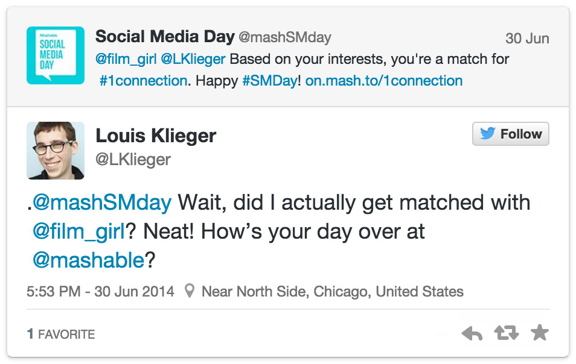
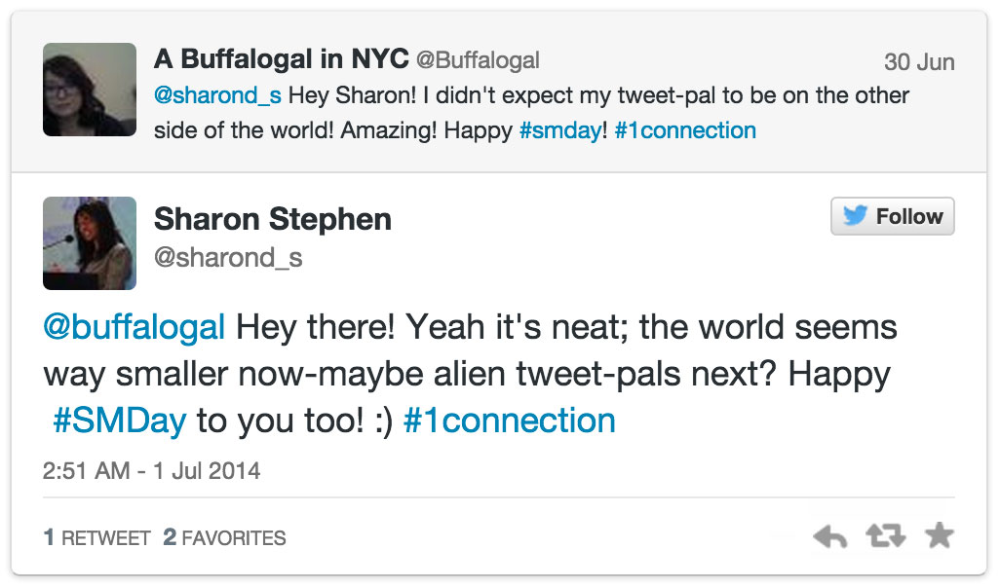
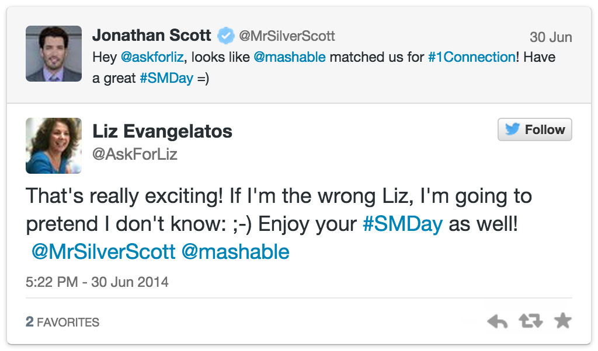

User Interest Matching Campaign
===============================

This codebase was originally designed for Mashable's #1Connection campaign. We have open sourced it for others to run their own similar campaigns.  Here are a few example conversations that resulted for Mashable.

This code/campaign runs in the following way:

- The brand/company announces participation of users tweeting with a #hashtag
- At a defined time in the future, the brand/company runs the tool, which:
	- Finds all unique users who tweeted with the #hashtag in a given timeframe (using GNIP)
	- Filters out users who use offensive words given a "banned words" list
    - Categorizes users into buckets based on their previous tweets (categories provided by brand)
- After review, the brand/company uses to the tool to send tweets with @mention introductions to users who match on category

Requirements
------------

- Node.js version v0.10.28
- A GNIP account with access to the Search API

Installation
------------
If you do not have Node.js installed, you can download the download the latest from <http://nodejs.org/>

Note: only preface these commands with 'sudo' if your Node.js was installed with root privileges.

Install the Grunt CLI

	npm install -g grunt-cli

Install dependencies

	npm install
  
Run the app

	grunt
  
Open the application in a browser: http://localhost:3000/

Categorization
----------

Categorization of users is done based on corpuses of in the `corpus` directory. Each file is a  collection of words that are associate with that category. (In practice, a set of titles or paragraphs about that topic.) The corpuses are initialized at server startup time.

When matching, the tool finds the last N tweets from a user and runs a matching algorithm against each corpus. The category with the strongest match is then chosen as the user's category for later user-user matching.

Filtering offensive words
----------

The code sample includes a profanity.js file to search for and filter out banned words. Tweets with such words are not included in the user matching, and therefore these users are not @mention introduced.

Please inspect the matches manually before sending out introductions to ensure there are no offensive matches or other issues with the campaign.

Date Formats
----------

Date formats in the UI follow the GNIP data format, which is `YYYYMMDDHHM`. Below are some examples:

- Start: 201406120400
- To Friday: 201406270401
- Thru Sunday: 201406300401

Production mode
----------

The default settings in config.js have the program working in dev mode (ie, it does not use live tweets and does not send @mention introductions). To operate in production mode, change the following settings:

	mode: prod
	send_tweets: true

Mashable Introduction and Recap
------------------

- [#1Connection Social Media Day](http://mashable.com/2014/06/13/1connection-social-media-day)
- [#1Connection Social Media Day: Recap](http://mashable.com/2014/07/02/1connection-social-media-day-recap)

Todo
----
1. Check that users exist before sending out tweets
2. Easier way to import the corpus 
3. Check that all requires are necessary
4. Clear out database tables after matches are sent
5. Check for unfilled template variables before sending tweet
6. If possible, add a function that checks status of previous action to make sure the current action can run
